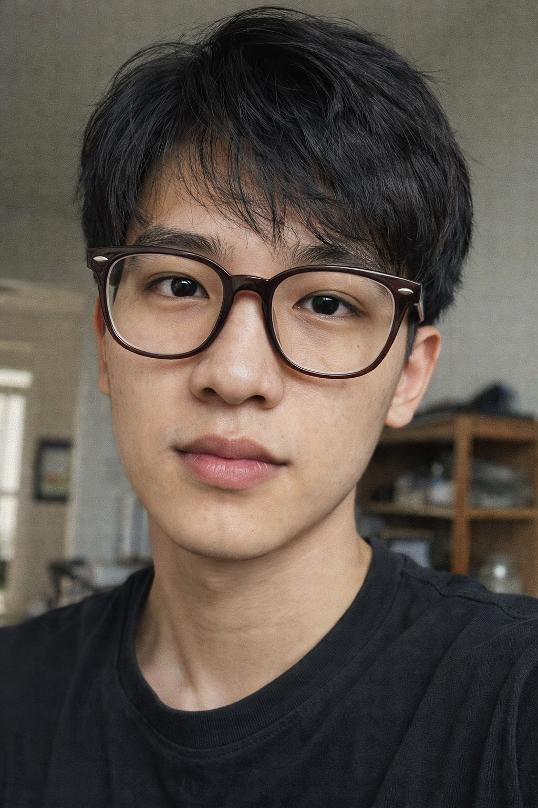
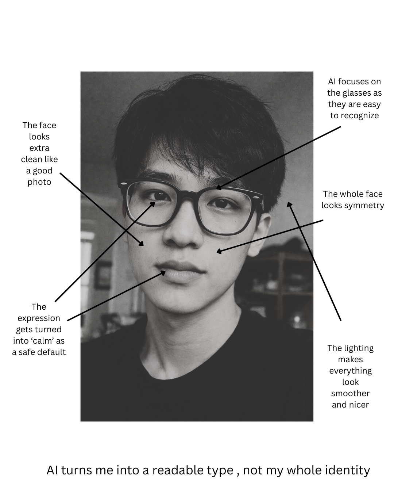

# Week 3 – Selfie & Identity
Student Name: Duc Tran
Project: AI Selfie
Tools Used: Chat-GPT for image creation, Canva for image editing

## The Images (description)
Image 1: AI-Generated Selfie

This is my AI-generated selfie made from a text prompt. It looks realistic and matches some of my features like glasses, noses and lip, but it also feels like a “clean” and simplified version of me because the model chooses a neutral expression and smooth lighting.

Image 2: Remixed Selfie

This is an edited version of the AI selfie where I intervened by adding labels, arrows, and a small distortion by changing the filter to look like a newspaper color and lowering the skin smoother. I highlighted what the AI emphasized such as glasses, overall face, expressions.

## Reflection
Authenticity gets complicated when identity is co-constructed with AI because the final image is not only “me,” and it is not only “the model.” It is a mix of my choices and the system’s defaults. My prompt tells the model what to focus on, but the model still decides what looks “real,” “normal,” or “good.” That is where power shows up. AI tends to push faces toward a clean, readable look, with smooth lighting, balanced features, and a calm expression, because those patterns are common in its training data. So authenticity, for me, becomes less about perfect accuracy and more about being honest about the process: what I asked for, what the model filled in, and what got simplified.
In the AI selfie, I see myself in the obvious features, like my glasses, hair, noses and overall face shape. I also recognize the student vibe and the calm, straightforward mood. But I do not fully see myself in the parts that disappear when identity becomes an image. The selfie cannot hold my voice, my accent, my personality in motion, or the messy details of real life that make me specific. Even visually, the model tends to flatten complexity by making the lighting cleaner and the expression more neutral, which can feel like a default “professional” template. That is why I made the second version. By adding annotations and a small distortion in Canva, I showed what the AI emphasized and what it erased. The intervention does not “fix” the image, but it makes the gap between me and the AI version easier to notice.

## Attribution & AI-Use Statement
AI Tool Used: DALL·E (via ChatGPT)
Prompt (summary): “Generate for me a photorealistic selfie of a 20 years old Vietnamese man, oval face, short layered black hair, dark brown oversized glasses with thick frames, soft angled eyebrows, high-bridged prominent nose, heart-shaped lips with a natural skin texture.”
AI Output: One AI-generated photorealistic selfie image based on my text prompt.
My Contribution: Choose the final generated image, create a second version in Canva by adding arrows, labels, and a small distortion by changing the filter and lower the smoother and write the reflection.
Notes: I tried a few prompts to generate images then choose the final one where I see myself somewhere in the image generated by AI.

