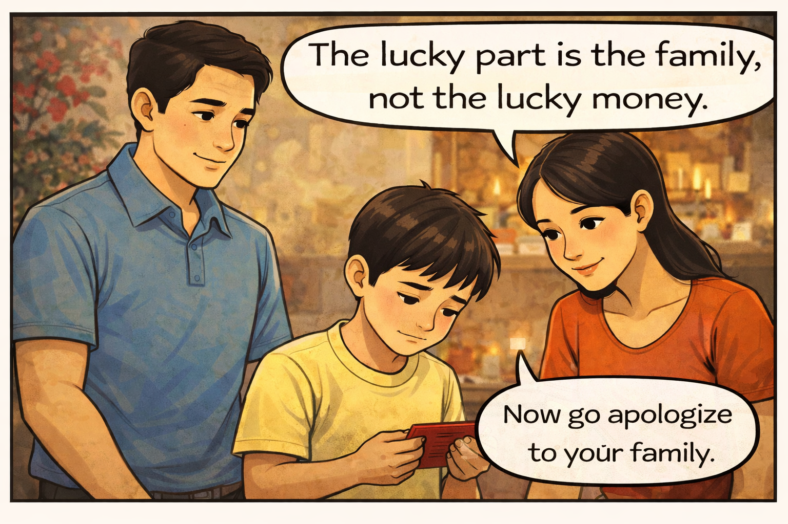
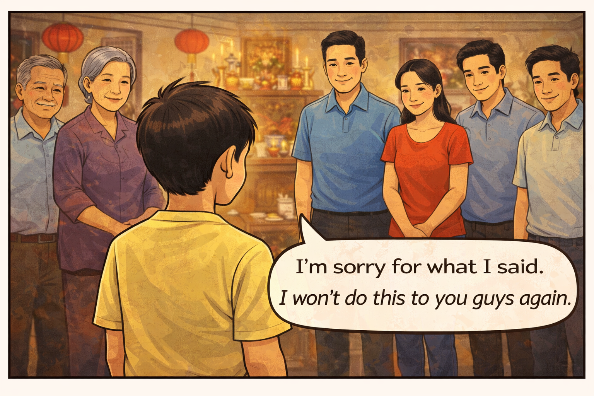
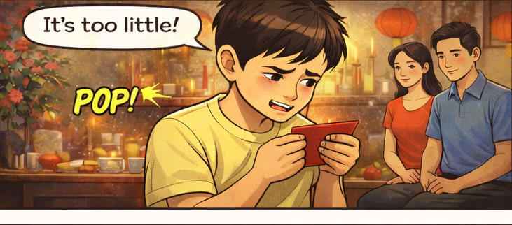
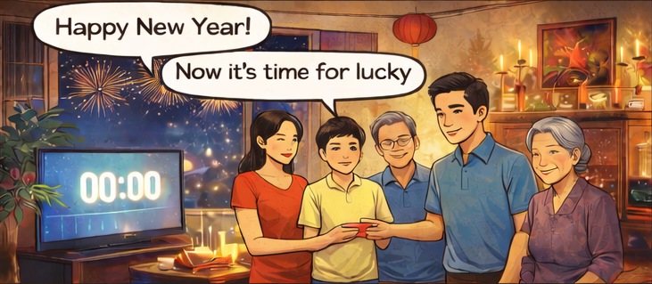

# Week 4 – Comic & Storytelling
Student Name: Duc Tran

Title: An’s lesson on the New Year Celebration.

Tools Used: DALL·E (images)

## Comic Description (6 Panels)
Panel 1

During the celebration of Lunar New Year, An’s family gives him a red envelope with lucky money.

Panel 2

His family gives him a red envelope with lucky money.

Panel 3

He opens it and says what he's thinking.

Panel 4

His mom and dad pull him aside to talk to him.

Panel 5

His parents tell him to apologize to his family because of his behavior.

Panel 6

He apologizes sincerely to his family and expresses remorse.

## Commentary (≈200 words)
When I started making this comic, I thought AI would make everything simple: generate the panels, add speech bubbles, and I would be finished. But the more I worked on it, the more I realized that a believable story needs careful human choices, especially for a cultural moment like Tết in Vietnam. The first drafts looked “correct” on the surface, but small things felt off. Some characters looked repeated, the boy’s shirt changed between panels, and the speech bubbles did not always point to the right person. Those details might seem minor, but they change the meaning. If the wrong person appears to speak, the whole lesson becomes confusing.

The comic format made me notice these problems faster than a paragraph would. I could see the emotional timing from panel to panel: excitement at midnight, the boy’s upset reaction, the parents pulling him aside, and the apology. I also had to control the boy’s expression so the reader understands he is not just being rude, he is reacting emotionally and then learning from it.

This project taught me that AI can generate images and dialogue, but it does not understand what makes a moment feel respectful and real. The story becomes meaningful only when I revise, correct, and decide what the lesson should be.

## Attribution & AI Use
AI Tool: DALL·E (images)

Human Contribution: Story idea about Tết (Lunar New Year) in Vietnam, panel sequencing, choosing character emotions, speech bubble placement, selecting the final images, dialogue.

AI Role: Generated image drafts and suggestions for panel sequencing.

