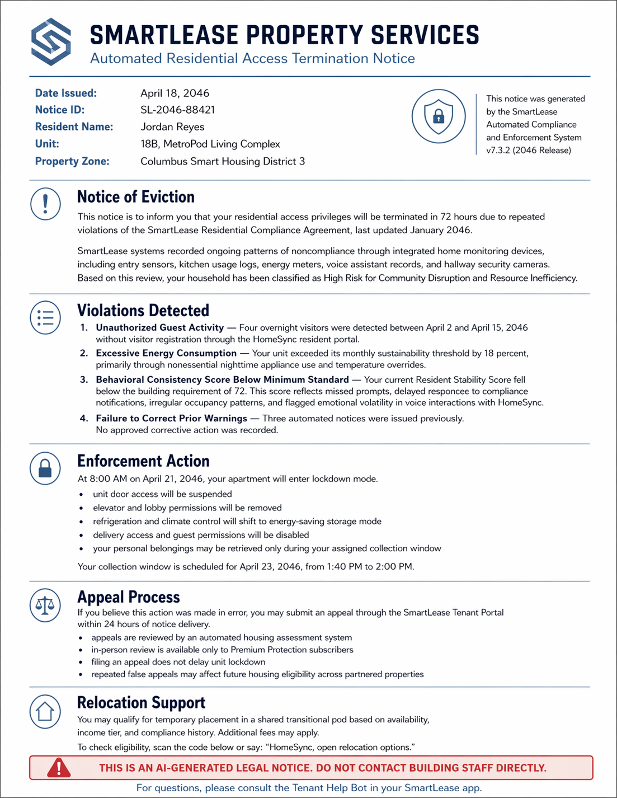

# Week 13 – Futures of AI & Humanity

## The Speculative Artifact
Title: Automated Residential Access Termination Notice

Format: Fiction document

Future Date: April 18, 2046

## Context Statement
This artifact depicts a near-future housing system in 2046 where AI is deeply embedded in everyday residential life. In this world, smart apartments do more than regulate temperature or monitor energy use. They collect behavioral data, track movement, record voice interactions, and generate compliance scores that affect whether a person is allowed to remain in their home. The artifact takes the form of an eviction notice from an automated housing company, showing a future in which housing decisions are made through algorithmic assessment rather than direct human judgment.

Several present-day trends lead to this imagined future. Smart-home devices already collect detailed information about domestic life through cameras, sensors, digital assistants, and connected appliances. Landlords and property companies increasingly rely on tenant-screening systems, data-driven pricing, and automated management platforms. At the same time, digital systems are becoming more common in areas such as hiring, policing, insurance, and credit scoring. This artifact exaggerates those developments and asks what might happen if housing becomes another fully monitored and automated domain.

The notice also reflects current inequalities in access to fairness. One of the most disturbing details is that in-person review is available only to premium subscribers. That detail extends a present reality in which better service, stronger protection, and real human assistance often go to people who can afford to pay more.

This future reveals an assumption that human-AI relations are not neutral. AI does not simply assist people. It can also become a tool through which institutions manage, classify, and punish them. In this artifact, AI appears efficient and rational, but it also removes empathy, accountability, and personal appeal. The result is a future where technological convenience and social control become tightly linked.

## Critical Reflection 
This future is not desirable, but it is also not impossible. That is what makes it unsettling. I do not think this exact version of 2046 is inevitable, but I do think it is avoidable only if society acts early. The artifact suggests a future where AI does not suddenly “take over.” Instead, it quietly expands the power of systems that already exist: surveillance, automation, landlord control, and unequal access to protection. That makes the future feel believable.

What this future reveals about the present is that many of our fears about AI are really fears about power. The problem is not only the technology itself. The deeper issue is who controls it, who benefits from it, and who is made vulnerable by it. Today, convenience is often used to justify more tracking, more data extraction, and more automated decision-making. This artifact pushes that logic further and shows what happens when efficiency matters more than dignity.

To avoid this future, several things would need to change. First, housing would need to be treated less like a market product and more like a social good. Second, stronger limits would need to be placed on data collection inside homes. Third, automated systems that affect major life outcomes should always include accessible human review. Finally, public conversations about AI should focus less on futuristic fantasies and more on the institutions already using these tools right now. In that sense, the artifact is not really about 2046 alone. It is about the choices being made in the present.

## Attribution & AI Use
AI tools used in creation: I used ChatGPT for drafting the artifact text, and helping me write the context statement, and for creating the visual base of the eviction notice document.
Human edits / authorship: I found the concept, revised the wording, shaped the critical angle, and decided how the future world would function.

